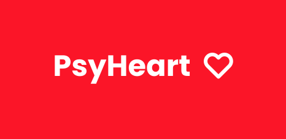

<h1 align="center">
  
</h1>

  <strong>
    🧠 PsyHeart application API ❤️ 
    PsyHeart is a platform that allows you to schedule an online session with a psychologist. 
    🧠 * Keep your mind aligned with your heart! * ❤️
  </strong> Practical project for study Inspired by Rocketseat's GoBarber 

  

    Access the repository of the web version of PsyHeart at: https://github.com/Silvio-Ronaldo/PsyHeart-web 
    Access the repository for the mobile version of PsyHeart at: https://github.com/Silvio-Ronaldo/psyheart-mobile
  
 

  
  
  
  
  

<h2>
  📋 Table of contents
</h2>
<ul>
  <li><a href="https://github.com/Silvio-Ronaldo/PsyHeart-back#-status">Status</a></li>
  <li><a href="https://github.com/Silvio-Ronaldo/PsyHeart-back#-concepts">Concepts</a></li> 
  <li><a href="https://github.com/Silvio-Ronaldo/PsyHeart-back#%EF%B8%8F-technologies">Technologies</a></li>
  <li><a href="https://github.com/Silvio-Ronaldo/PsyHeart-back#-author">Author</a></li>
  <li><a href="https://github.com/Silvio-Ronaldo/PsyHeart-back#%EF%B8%8F-license">License</a></li>
</ul> 

<h2>📌 Status</h2>
<h4 align="center">🚧 PsyHeart API is completed. 🚀</h4> 

<h2>🎯 Concepts</h2>

The PsyHeart API was developed by applying some of the most important concepts of backend development.

Specifically, it is a Rest API, responsible for managing business rules, receiving requests and returning data responses.

It was created using some development standards like S.O.L.I.D and Test Driven Development, the famous TDD. As a consequence of SOLID, I've also used dependency inversion to decouple services from ORM repositories and dependency injection with tsyringe, in addition to providers to implement the single responsibility principle.

To structure the files and directories in a compact way and provide easy navigation and maintenance, I used the principles of DDD (Domain Driven Design).

For security, the API uses JWT with BCryptJS hash. In ORM, I used TypeORM with node-postgres driver. For specific features of notifications and caching, I used mongodb and Redis, respectively. All run in a Docker container on the local machine.
 

<h2>🛡️ Technologies</h2>

The main tools used in the development of the project: 

<ul>
  <li><a href="https://nodejs.org/en/">Node.js</a></li>
  <li><a href="https://www.typescriptlang.org">TypeScript</a></li>
  <li><a href="https://expressjs.com/pt-br/">Express</a></li>  
  <li><a href="https://github.com/microsoft/tsyringe">tsyringe</a></li>
  <li><a href="https://jestjs.io/pt-BR/">Jest</a></li>
  
  <li><a href="https://typeorm.io/#/">TypeORM</a></li>
  <li><a href="https://www.docker.com">Docker</a></li>
  <li><a href="https://node-postgres.com">Node Postgres</a></li>
  <li><a href="https://www.mongodb.com/pt-br">MongoDB</a></li>
  <li><a href="https://redis.io">Redis</a></li>
  <li><a href="https://aws.amazon.com/pt/s3/">Amazon S3</a></li>  
  
  <li><a href="https://github.com/arb/celebrate">Celebrate</a></li>
  <li><a href="https://github.com/typestack/class-transformer">class-tranformer</a></li>
  <li><a href="https://handlebarsjs.com">Handlebars</a></li>
  <li><a href="https://www.npmjs.com/package/multer">multer</a></li>
  <li><a href="https://nodemailer.com/about/">Nodemailer</a></li>
  <li><a href="https://jwt.io">JWT</a></li>  
  
  <li><a href="https://babeljs.io">Babel</a></li>
  <li><a href="https://eslint.org">ESLint</a></li>
  <li><a href="https://prettier.io">Prettier</a></li>
</ul> 

<h2>👽 Author</h2>
<table>
  <tr>
    <td align="center"><a href="https://github.com/Silvio-Ronaldo"> <b>Silvio Ronaldo</b></a> <a href="https://github.com/Silvio-Ronaldo" title="Silvio Ronaldo">🍀</a></td>
  </tr>
</table>

Leave your star, fork the project or open a pull request ❤️

Contact me on social networks: 

 

<h2>⚖️ License</h2>

<strong>PsyHeart API is MIT licensed, as found in the <a href="./LICENSE">LICENSE file</a>.</strong>

